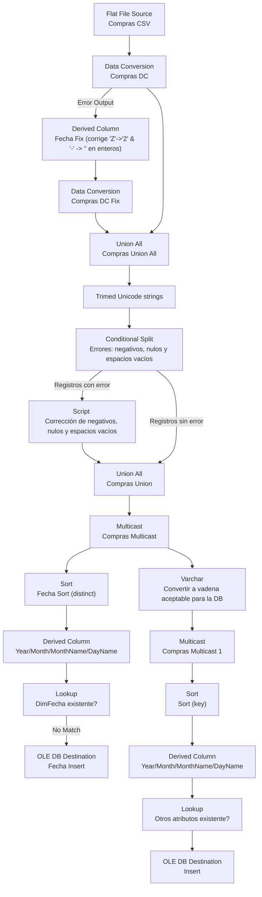
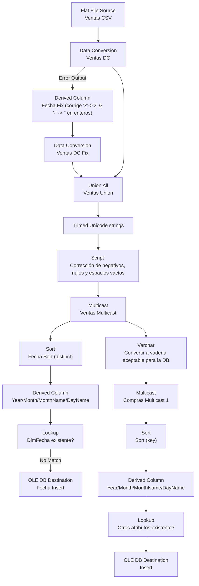

# Proceso ETL de la empresa SG-FOOD: 

## Pasos ETL
### Compras

### Ventas


## ¿Por qué se eligio el modelo constelación?
Debido a el cambio que esta teniendo la organización, debido a el aumento en la complejidad de sus datos a analizar. Este modelo es adaptable a trabajar con normalización o con desnormalización, entonces gracias al cambio que puede tener el negocio es bueno usar un modelo adaptable como el de constelación de hechos.

## Analisis
### Hechos
1. **Venta**
    - Sucursal (FK)
    - Producto (FK)
    - Fecha

2. **Compra**
    - Producto (FK)
    - Proveedor 
    - Fecha

### Dimensiones
3. **Producto**
    - Precio venta
    - Precio compra
    - Tipo

4. **Sucursal**
    - Región

5. Fechas en:
    - Año 
    - Mes
    - Semana (del mes)
    - Dia

6. **Proveedor**
    - nombre

## SQL del DDL
``` SQL 
Table Venta_hecho {
  id integer [primary key]
  fecha_id int [foreign key]
  sucursal_id varchar(10)   [foreign key]
  cliente_id varchar(8)   [foreign key]
  vendedor_id varchar(8)   [foreign key]
  product_id varchar(8)   [foreign key]
  unidades  integer
  price  decimal (10,2)
}
Table Compra_hecho{
  id integer [primary key] 
  fecha_id int [foreign key]
  sucursal_id varchar(10)   [foreign key]
  product_id varchar(8)  [foreign key]
  provider_id varchar(8) [foreign key]
  unidades integer
  price decimal (10,2)
}
Table Fecha_dim {
  id int [primary key]
  fecha date
  year smallint
  month tinyint
  week_of_month tinyint
  day_of_week tinyint
}

Table Product_dim {
  id varchar(8) [primary key]
  name varchar(32) [not null]
  category_id integer [foreign key]
  branch_id integer [foreign key]
}
Table Category_dim {
  id integer [primary key]
  name varchar (16) [not null]
}
Table Branch_dim {
  id integer [primary key]
  name varchar (16) [not null]
}
Table Provider_dim {
  id varchar (8) [primary key]
  name varchar (24) [not null]
}
Table Client_dim {
  id varchar(8) [primary key]
  name varchar (24) [not null]
  type varchar (24) 
}
Table Vendedor_dim {
  id varchar(8) [primary key]
  name varchar (24) [not null]
}
Table Sucursal_dim {
  id varchar (10) [primary key]
  name varchar(32)
  region varchar(16) [not null]
  department varchar(16) [not null]
}

```

