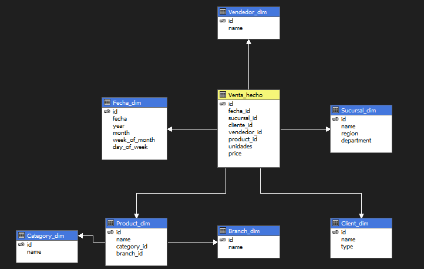
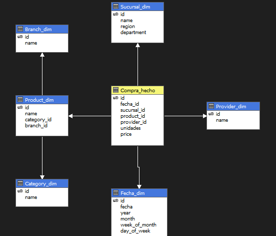

### SG-FOOD
## Definición del cubo OLAP

## KPIs 

### Ventas

| KPI                    | Definición                                                        | Justificación                                         |
|------------------------|-------------------------------------------------------------------|-------------------------------------------------------|
| vendedores-sucursal    | Listado de vendedores con más ventas por sucursal                 | Validación y compensación a los vendedores            |
| meses-ventas           | Muestra los meses con más ventas                                  | Análisis de mercado e inversión planificada           |
| clientes-categoría     | Dispersión de qué categoría es más comprada según los clientes    | Promociones a clientes según sus gustos               |
| marcas-mas vendidas     | Pie estadistico de marcas más vendidas    | Analisis de que marcas son las favoritas del mercado          |

### Compras
| KPI                    | Definición                                                        | Justificación                                         |
|------------------------|-------------------------------------------------------------------|-------------------------------------------------------|
| proveedores-sucursal    | Listado de proveedores con más compras por sucursal                 | Validación y compensación a los proveedores por su fidelidad      |
| semanas-compras           | Muestra las semanas donde se compro más                        | Análisis de mercado e inversión planificada           |
| utilidad     | Listado de productos y ccategorias más beneficiosas    | Aplicación del mercado planificado              |
| marcas-mas compradas     | Pie estadistico de marcas más compradas | Analisis y reflexión de gastos por marca |

## Expliacaciones

### Balanced Scorecard

Balanced Scorecard es

### Rolling Forecast

##